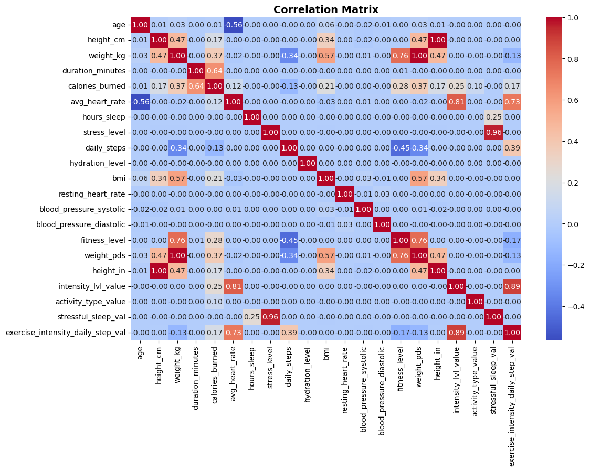
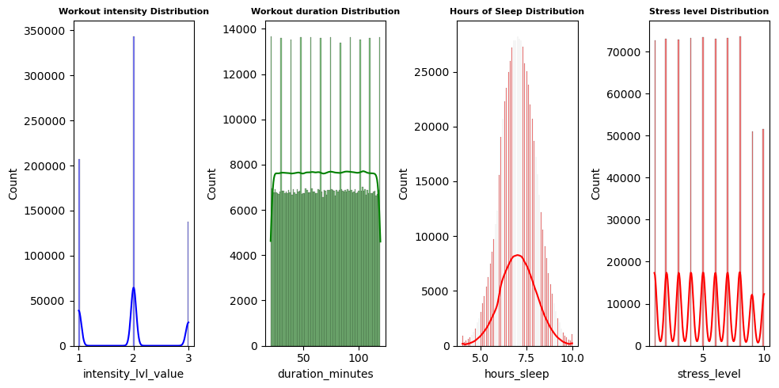
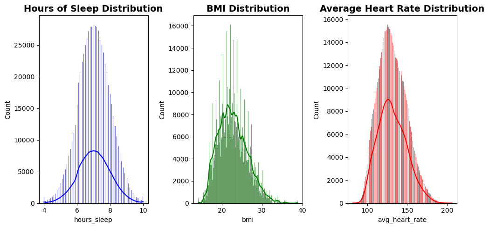
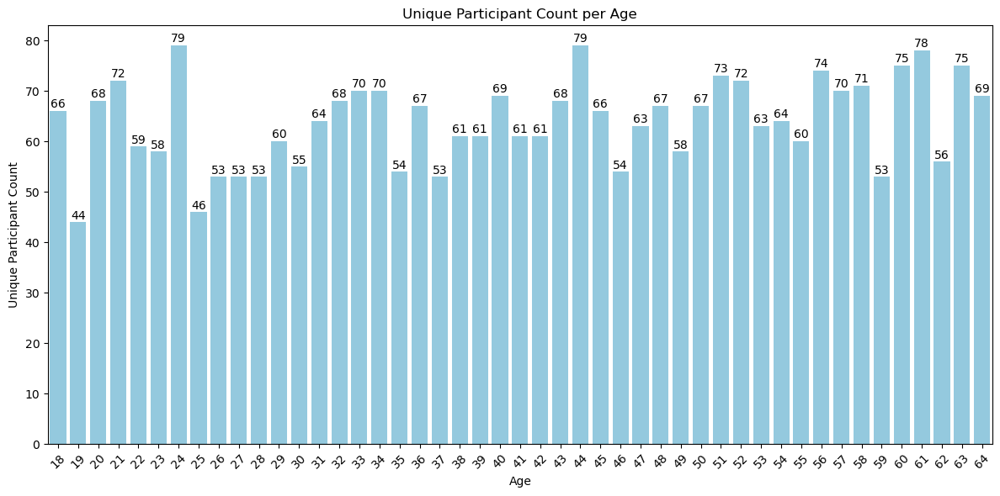
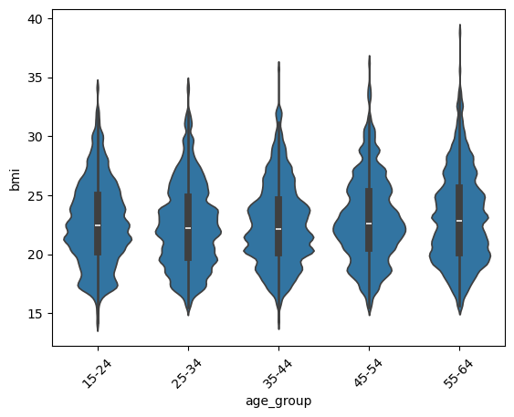
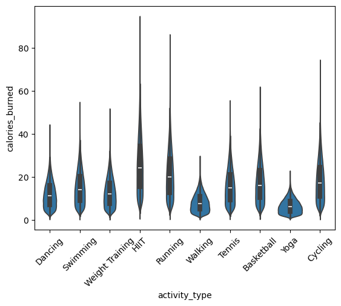
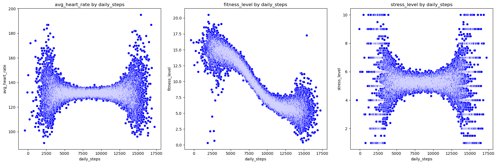
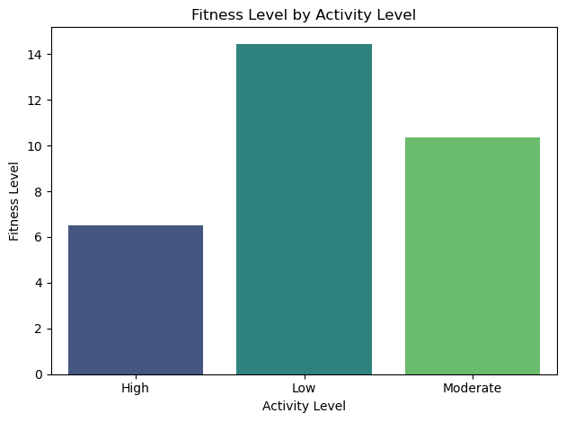
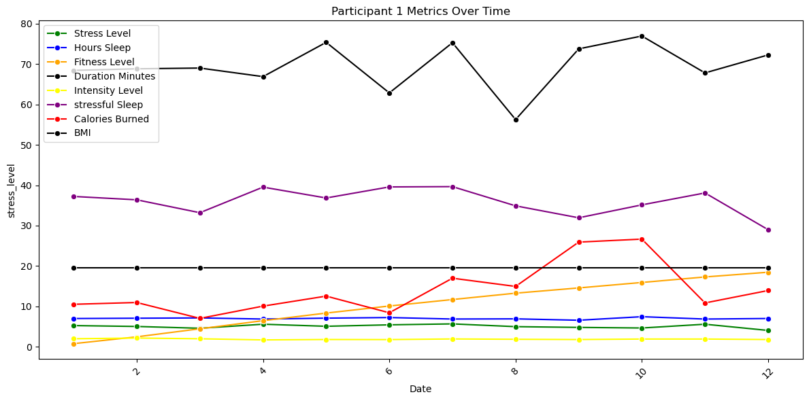
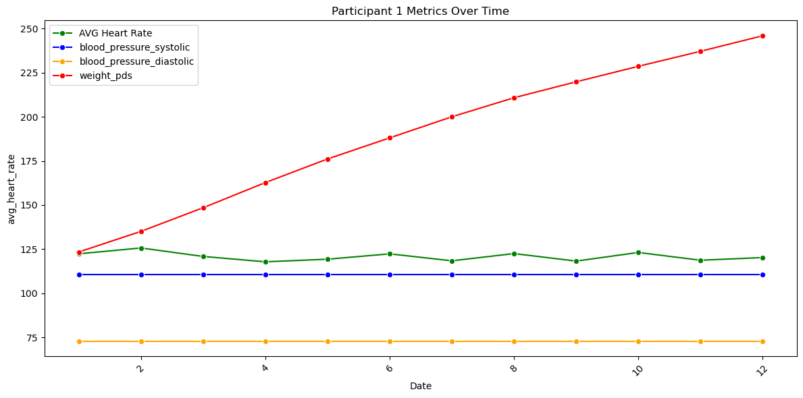

 

# Health Fitness Exploratory Data Analysis(EDA) Project Scope
SCOPE: 
FitLife360 is a synthetic dataset that simulates real-world health and fitness tracking data, gathered from 3,000 participants over the course of one year. The dataset encapsulates daily activities, vital health metrics, and various lifestyle factors, which makes it a valuable resource for health analytics and predictive modeling. Using this dataset, we will conduct Exploratory Data Analysis (EDA) to better understand the data, explore potential correlations, and investigate the most effective ways to utilize this information for health and fitness insights.
  
Data Source :   This dataset is publicly available on Kaggle, under the repository name "FitLife: Health & Fitness Tracking Dataset." You can access it here. https://www.kaggle.com/datasets/jijagallery/fitlife-health-and-fitness-tracking-dataset/data

# Research Objective
The key objective of this research is to derive meaningful insights about the health status of the participants using the available data. Specifically, we aim to investigate several questions:
         - What are the typical ranges of fitness levels and health metrics among the participants?
         - Are there any significant correlations between different health indicators, such as stress levels, sleep quality, and heart rate?
         - Can we observe any trending improvements in health or fitness over the year, particularly in relation to lifestyle factors like exercise and sleep?
         - How does blood pressure correlate with the overall health and fitness of the participants?
By analyzing these aspects, the goal is to gain a deeper understanding of how the lifestyle factors captured in the dataset relate to health outcomes, such as fitness levels, blood pressure, and heart rate.

# Data Set and Methodology and Exploration
The dataset originally consisted of 22 columns describing the health statuses of 3,000 participants across a one-year period. The first step in our analysis involved identifying key categorical variables, such as age, gender, and health conditions, along with numerical columns like BMI, heart rate, and steps per day.  
 
During the initial exploration, we identified several extreme outliers that could potentially skew the analysis. For instance, certain values in the weight and daily steps columns were abnormally high, which could distort the findings. The following table highlights some of these outliers: 

 
A crucial part of our analysis also involved understanding the calculation behind the fitness level column, as this metric is central to evaluating participants' health and fitness. The fitness level score is calculated using a weighted formula that accounts for various factors such as exercise duration, intensity, calories burned, sleep, stress levels, and BMI. This formula provides a score on a scale from 0 to 10. Understanding how this score is computed allowed us to reverse-engineer it into its raw components, which will enable us to perform more granular analysis.  

#### Fitness level Formula
    fitness_level = (duration_minutes/60 x intensity_weight) + (calories_burned / 100 x calorie_burned) + (100 / resting_heart_rate x heart_rate) - (stress_level x stress_penalty)+(daily_steps / 10,000  x steps_weight)+(hours_sleep / 8 x sleep_bonus)+(bmi / 25 x bmi_weight)  

 After converting the fitness level back to its raw score, we were able to perform more precise data analysis, allowing for a deeper understanding of the factors influencing fitness outcomes. 

### Correlation Analysis
To identify relationships within the dataset, we created a correlation matrix to uncover any significant correlations between health and fitness variables. The results provided valuable insights, though some of the key relationships we anticipated were not as pronounced as expected. For instance, while we hypothesized that stress levels and sleep duration would strongly correlate with other health indicators such as BMI and heart rate, the correlation chart revealed that these relationships were not as significant as initially thought. 

 
We also needed to visualize these correlations and the presence of outliers to determine if any extreme data points should be removed for further analysis. The boxplots below illustrate the distribution of key variables and help in visualizing outliers: 

  
  

In the process of exploring the dataset, we broke down key variables into input and output categories:
 
    Input veriables - exercise intensity, daily activity, sleep hours, stress level 
    
     Ouput variables - heart rate, blood pressure, BMI  
    
 The analysis focused on understanding how these input variables (daily steps, intensity of exercise, and sleep hours) impacted output variables (heart rate, blood pressure, and BMI). These relationships can provide valuable insights into how different lifestyle factors contribute to overall fitness levels.

# Focus Topics
 ### Age
 The age distribution of participants is fairly balanced, with the lowest age of 19 having 44 participants and the highest age group having 79 parcticpants.  
  
  We also found when showing age and BMI distrobutions the groups had similar means but varide in the density of body fat. 
  

 ### Activity
 The dataset includes information about the types of exercises performed and the corresponding calories burned. We visualized the relationship between different types of exercises and the calories burned in each activity category. 
   
 

 ### Interesting correlations
 A key observation was the cumulative fitness score, which revealed some extreme outliers that required further investigation. For example, we identified that participants with very high daily step counts (over 125,000) were varing greatly in there fitness level scoring.  
 
    Addtionally, we observed an overall higher concentration of high fitness level scores in the lower intensity activity category. 
  
 

 ### Single Use case
 We also conducted a detailed analysis of a single participant's metrics over time, which allowed us to track their fitness progression. This individual-level analysis can be used to develop personalized health plans or detect early signs of potential health issues with further analysis and tool application.  
 
 

# Conclusion
From the exploratory analysis of the FitLife360 dataset, we derived several key insights:

    Resting Heart Rate: The majority of individuals in the dataset had a resting heart rate within the normal range, although there were some outliers with both very low and very high heart rates.

    Height and Weight Variation: There was significant variation in height and weight among participants, which impacted other health metrics like BMI and overall fitness levels.

    Blood Pressure: The systolic and diastolic blood pressure values showed a broad range, including healthy, prehypertensive, and hypertensive levels, which could be valuable in identifying potential health risks.

# Recommendations
Futher in-depth analysis, could be performed on this data set particularly in the followin areas.
    The finding that individuals with high step counts and low fitness levels may benefit from further investigation. A potential focus could be understanding why certain individuals with a large amount of physical activity score low on fitness levels. This could involve exploring the quality and intensity of exercise, as well as factors such as sleep and stress.

    Future work could involve developing predictive models that assess health outcomes based on variables such as daily steps, sleep, and stress levels. This could lead to better decision-making for health professionals and individuals alike.