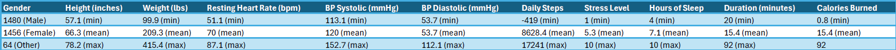
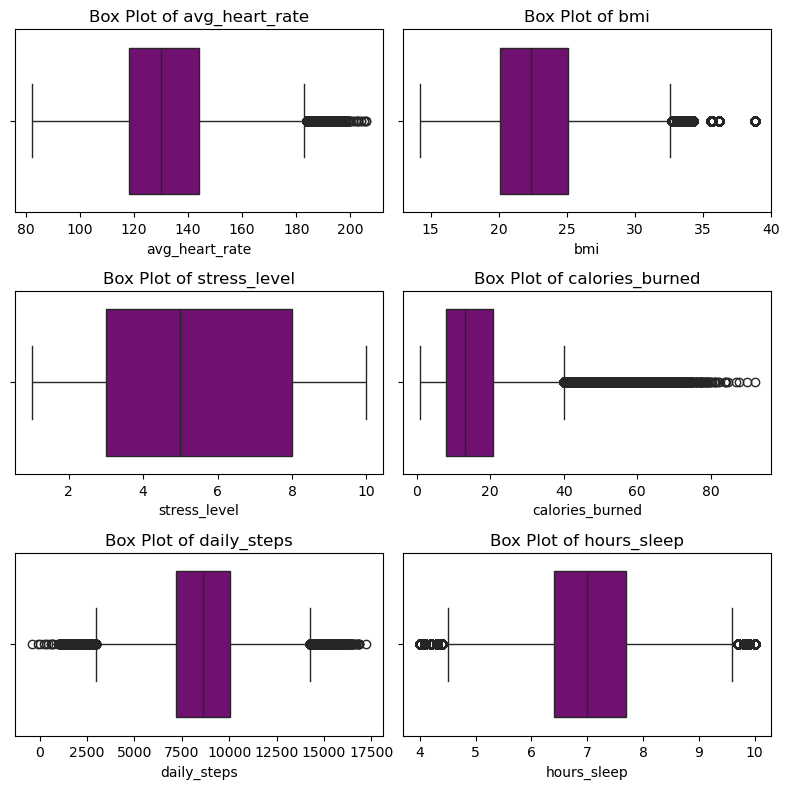
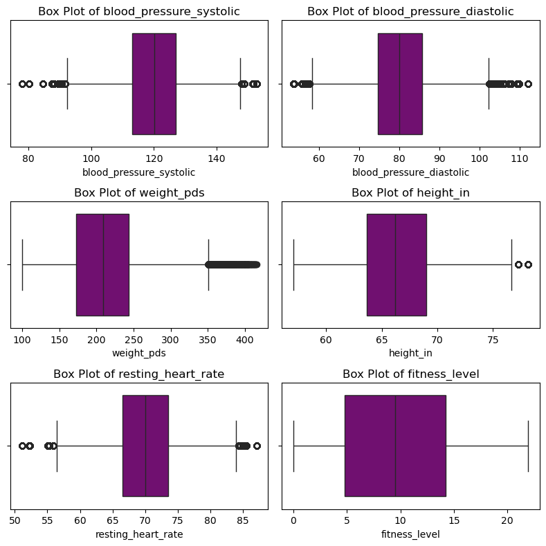

# Health-Fitness_project Scope
Scope:
FitLife360 is a synthetic dataset that simulates real-world health and fitness tracking data from 3,000 participants over a one-year period. The dataset captures daily activities, vital health metrics, and lifestyle factors, making it valuable for health analytics and predictive modeling.

# Research Objective
With this data what can we tell about the health status of the participants. What ranges and levels of fitness are the participants. are there any meaning full correlations in the data set. Can we see any trending health improvement from the participants. is blood pressure an overall identifier for a healthy active participant.

# Data Set and Methodology and Exploration
The data set began with 22 columns describing the health statuses of 3,000 participants over a one-year period. After exploring the data by identifying major catagorical minimums maximiums and mean. It was clear that the data had some significant outliers that will scew the analysis. as seen in the following chart.

After identifiying some of the extremes of the data we needed to to vizulaize the extremness and relivence of the outliers to see if they needed to be removed or retained to enhance our analysis. 

  
  

# Focus Topics

# Conlustion

# Recommendations